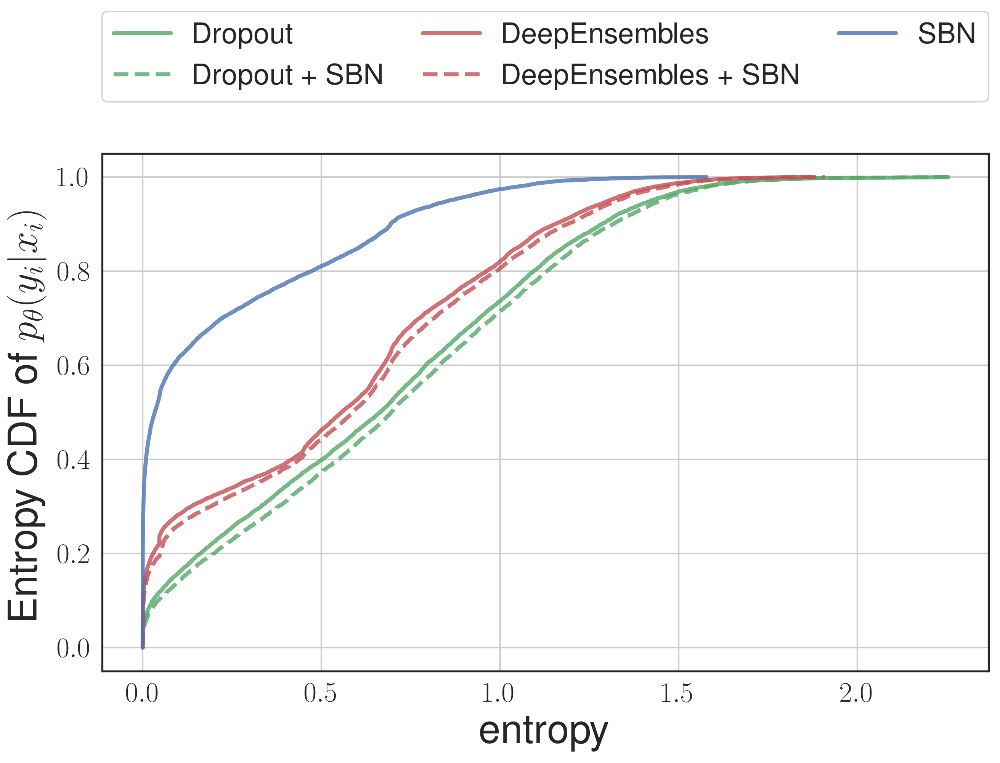
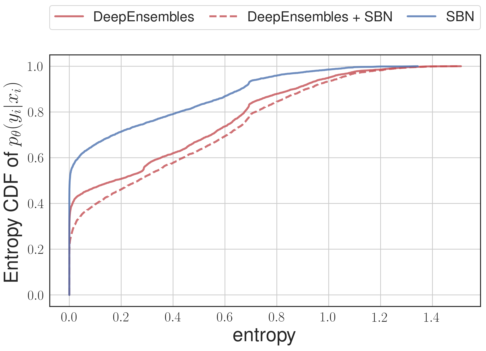
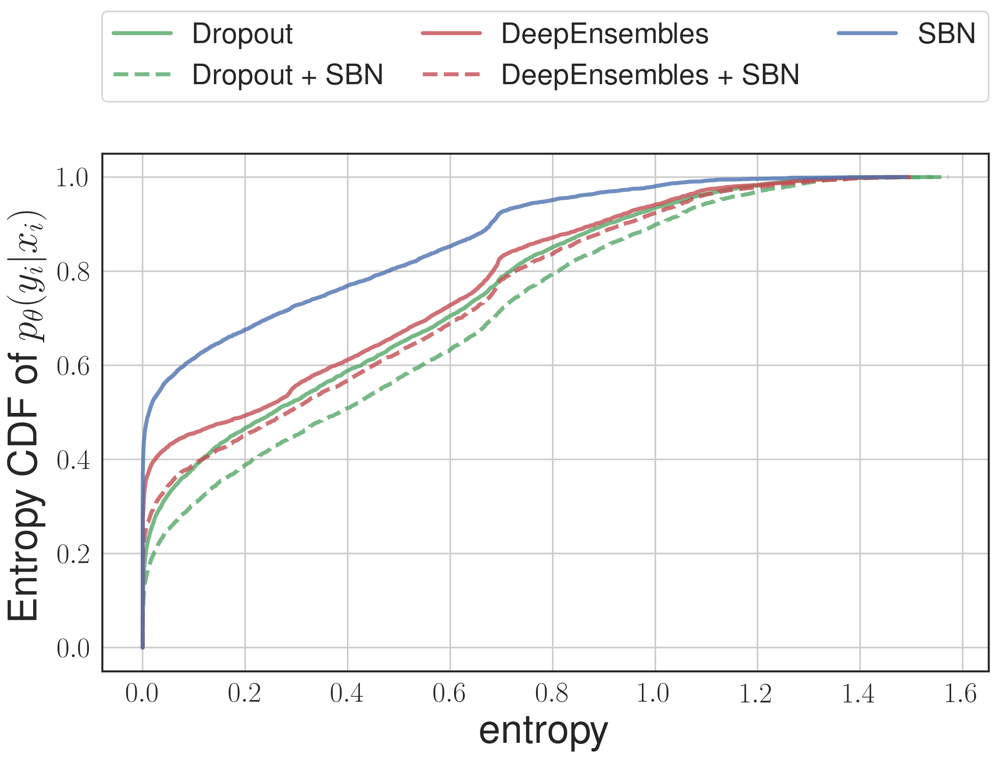

# Uncertainty Estimation via Stochastic Batch Normalization

This repo contains code for our paper [Uncertainty Estimation via Stochastic Batch Normalization](https://arxiv.org/abs/1802.04893).

__Abstract__

In this work, we investigate Batch Normalization technique and propose its probabilistic interpretation. We propose a probabilistic model and show that Batch Normalization maximizes the lower bound of its marginalized log-likelihood. Then, according to the new probabilistic model, we design an algorithm which acts consistently during train and test. However, inference becomes computationally inefficient. To reduce memory and computational cost, we propose Stochastic Batch Normalization -- an efficient approximation of proper inference procedure. This method provides us with a scalable uncertainty estimation technique. We demonstrate the performance of Stochastic Batch Normalization on popular architectures (including deep convolutional architectures: VGG-like and ResNets) for MNIST and CIFAR-10 datasets.

## Launch experiments

To reproduce the resulats follow the `results.ipynb`. 

## Accuracy and NLL results

|  Network  |     Method     |Error%|      |  NLL  |       |
|:---------:|:--------------:|:----:|------|:-----:|-------|
|           |                |No SBN| SBN  | No SBN|  SBN  |
| LeNet-5   | SBN            | ---  | 0.53 |  ---  | 0.025 |
|           | Deep Ensembles | 0.40 | 0.40 | 0.016 | 0.015 |
|           | Dropout        | 0.42 | 0.42 | 0.014 | 0.014 |
| VGG-11    | SBN            |  --- | 5.76 |  ---  | 0.302 |
|           | Deep Ensembles | 4.81 | 4.81 | 0.191 | __0.162__ |
|           | Dropout        | 5.32 | 5.38 | 0.155 | __0.149__ |
| ResNet-18 | SBN            | ---  | 4.35 |  ---  | 0.255 |
|           | Deep Ensembles | 3.37 | 3.34 | 0.138 | __0.110__ |

## Uncertainty estimation

To estimate uncertainty we calculate entropy of predictive distribution on out-of-domain data.

| __LeNet-5 on notMNIST__ |__ResNet-18 on CIFAR5__|__VGG-11 on CIFAR5__|
|:--:| :----:|:---:|
|  |  | 


# Citation

If you found this code useful please cite our paper 

```
@article{stochbn2018,
  title={Uncertainty Estimation via Stochastic Batch Normalization},
  author={Atanov, Andrei and Ashukha, Arsenii and Molchanov, Dmitry and Neklyudov, Kirill and Vetrov, Dmitry},
  journal={arXiv preprint arXiv:1802.04893},
  year={2018}
}
```